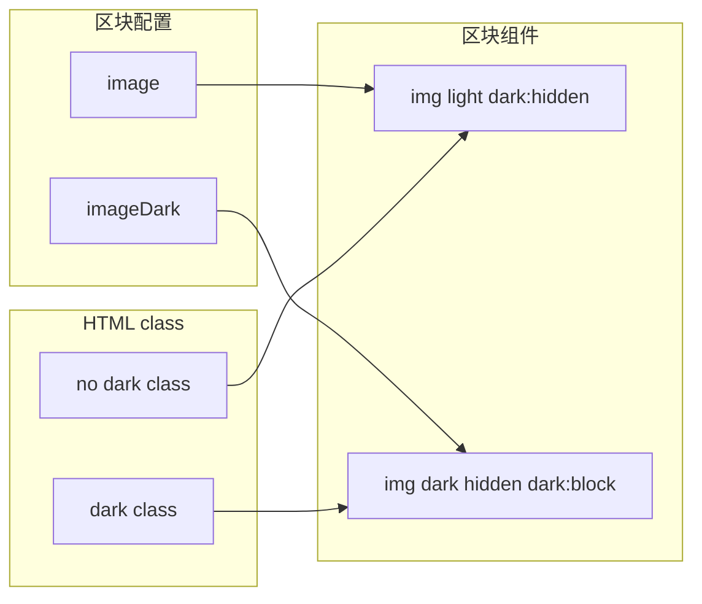

暗黑模式下，页面背景已经切换成深色，但产品截图、功能展示图如果仍是亮色界面，会显得突兀——一块亮堂的区域嵌在暗色背景里，既破坏整体观感，也削弱暗黑模式带来的沉浸感。如果我想要在主题切换时，让图片也随之自动换成适配暗色背景的变体，该怎么做？

假设你已经用 Tailwind 的 `darkMode: "class"` 做主题切换，`document.documentElement` 带有 `dark` 类即表示暗黑模式。那么核心就是选一个与现有主题体系一致、且不需要在业务组件里引入主题逻辑的方案。

## 方案：双 img + CSS 切换

采用 **双 img + Tailwind dark 类** 的方式：亮色图用 `dark:hidden`，暗色图用 `hidden dark:block`。这样无需在组件里调用主题 API，逻辑完全由 CSS 控制，和你已有的 `dark:` 用法保持一致。

```html
<!-- 亮色模式显示 -->

<!-- 暗黑模式显示 -->

```

## 数据层：增加 imageDark 字段

在区块配置里，为每项增加 `imageDark` 字段，导入暗色图变体（如 `hero-dark.webp`）。若某区块暂无暗色图，可以用 `imageDark: image ?? image` 或直接复用 `image` 作降级，保证页面不会出错。

```js
{ id: "overview", ..., image: heroLight, imageDark: heroDark },
```

## 数据流示意

从数据源、模板到最终展示，三者的关系如下：数据层提供 `image` 与 `imageDark`，模板层用两张 img 分别绑定，主题层通过 HTML 的 `dark` 类决定哪一张可见。



## 暗色图资源准备

暗色图放在任意静态资源目录即可，命名如 `hero-dark.webp`、`card-01-dark.webp` 等。若暂时没有真实暗色变体，可以先让 `imageDark` 指向对应的 `image`，待设计稿到位后再替换，不影响功能与布局。

:::info-panel

:::
